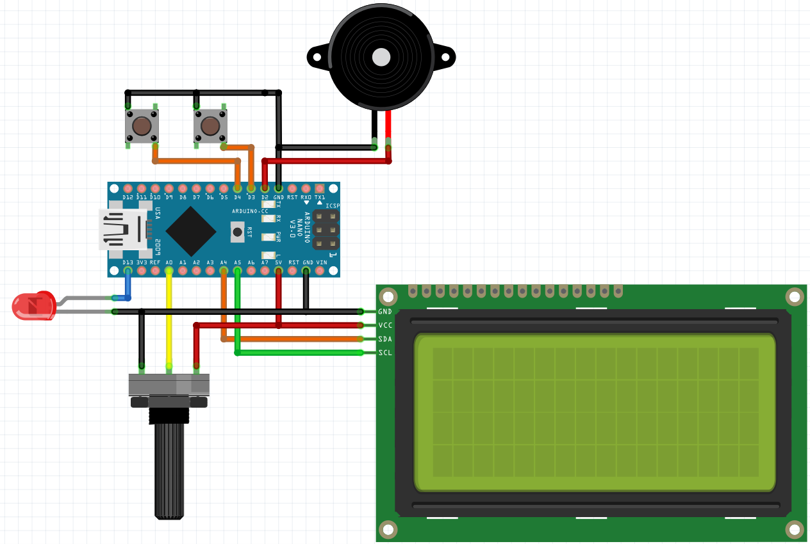

# Arduino Morse Trainer - Arduino-based Morse Code Transmitter and Decoder

## Features
✔️ Real-time Morse code input and decoding  
✔️ Adjustable speed (WPM)  
✔️ User-friendly 4x20 LCD screen interface  
✔️ Audio and visual feedback (Buzzer & LED)  
✔️ 3D printable custom case  
✔️ Four different screen and connection options  

## Hardware Connections

### **LCD Connection (Parallel - Without I2C)**
- VSS → GND  
- VDD → 5V  
- VO → GND for medium brightness (or use a potentiometer)  
- RS → D7  
- RW → GND  
- EN → D8  
- D4 → D9  
- D5 → D10  
- D6 → D11  
- D7 → D12  
- A+ (Backlight) → 5V (via 220Ω resistor)  
- K (Backlight) → GND  

### **LCD I2C Connection**
- GND → GND  
- VCC → 5V  
- SDA → A4  
- SCL → A5  

### **Other Connections**
- **Potentiometer:**
  - Middle pin → A0  
  - Side pins → 5V and GND  
- **LED:** D13  
- **Buzzer:** D2  
- **Morse Button:** D3  
- **Screen Reset Button:** D4  

## Code Versions
This project includes four different code versions:  
1. **2x16 LCD, Without I2C**  
2. **2x16 LCD, With I2C**  
3. **4x20 LCD, Without I2C**  
4. **4x20 LCD, With I2C**  

## **Setup & Usage**
1. Upload the appropriate code version to the Arduino.  
2. Adjust the speed using the potentiometer.  
3. Send Morse code using the button and monitor the screen.  
4. Use the second button to clear the screen.  

## **Wiring Diagram**
You can see the wiring diagram created using Fritzing below:

---

# Arduino Morse Trainer - Arduino ile Morse Kod Verici ve Çözücü

## Özellikler
✔️ Gerçek zamanlı Morse kodu girişi ve çözümü  
✔️ Ayarlanabilir hız (WPM)  
✔️ Kullanıcı dostu 4x20 LCD ekran arayüzü  
✔️ Sesli ve görsel geri bildirim (Buzzer & LED)  
✔️ 3D yazıcı ile basılabilir özel tasarım kutu  
✔️ Dört farklı ekran ve bağlantı opsiyonu  

## Donanım Bağlantıları

### **LCD Bağlantısı (Paralel - I2C Olmadan)**
- VSS → GND  
- VDD → 5V  
- VO → Orta parlaklık için GND (veya potansiyometre)  
- RS → D7  
- RW → GND  
- EN → D8  
- D4 → D9  
- D5 → D10  
- D6 → D11  
- D7 → D12  
- A+ (arka ışık) → 5V (220Ω direnç üzerinden)  
- K (arka ışık) → GND  

### **LCD I2C Bağlantısı**
- GND → GND  
- VCC → 5V  
- SDA → A4  
- SCL → A5  

### **Diğer Bağlantılar**
- **Potansiyometre:**
  - Orta bacak → A0  
  - Yan bacaklar → 5V ve GND  
- **LED:** D13  
- **Buzzer:** D2  
- **Mors Buton:** D3  
- **Ekran temizleme Butonu:** D4  

## Kod Versiyonları
Bu proje için dört farklı kod versiyonu bulunmaktadır:  
1. **2x16 LCD, I2C olmadan**  
2. **2x16 LCD, I2C ile**  
3. **4x20 LCD, I2C olmadan**  
4. **4x20 LCD, I2C ile**  

## **Kurulum ve Kullanım**
1. Arduino'ya uygun kod versiyonunu yükleyin.  
2. Potansiyometre ile hızınızı belirleyin.  
3. Buton ile Morse kodu gönderin, ekranı takip edin.  
4. Ekranı temizlemek için ikinci butonu kullanın.  

## **Bağlantı Şeması**
Fritzing ile hazırlanmış bağlantı şemasını aşağıda görebilirsiniz:

